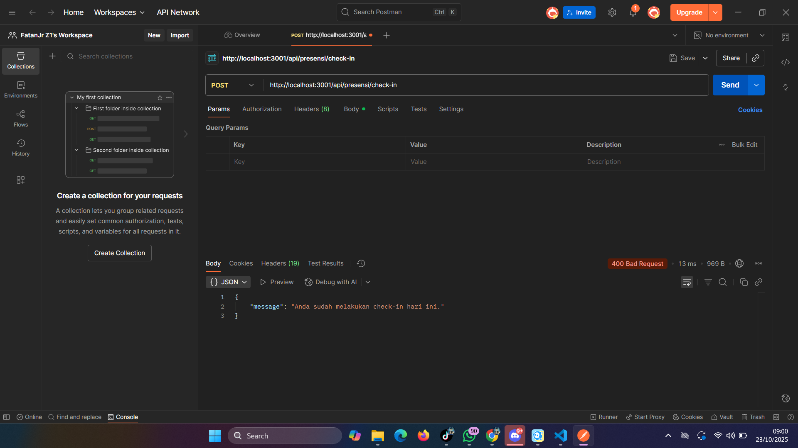
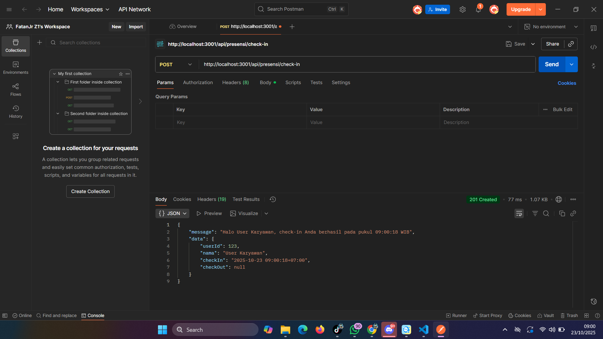
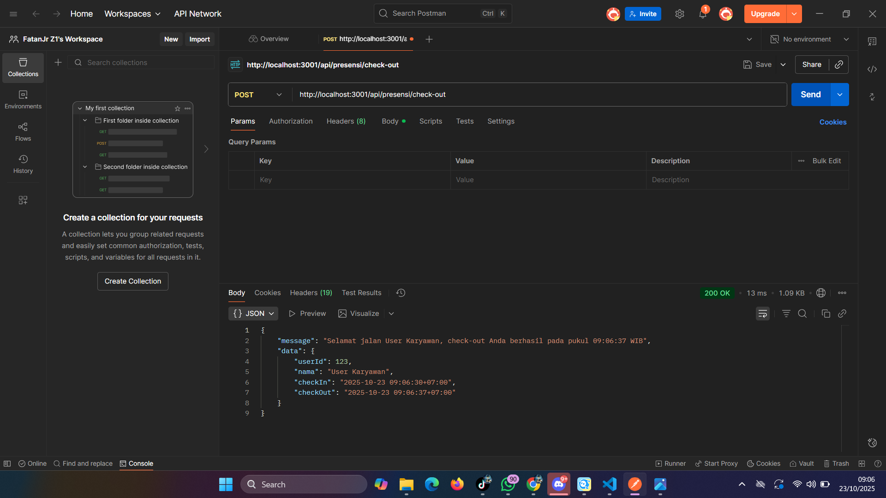
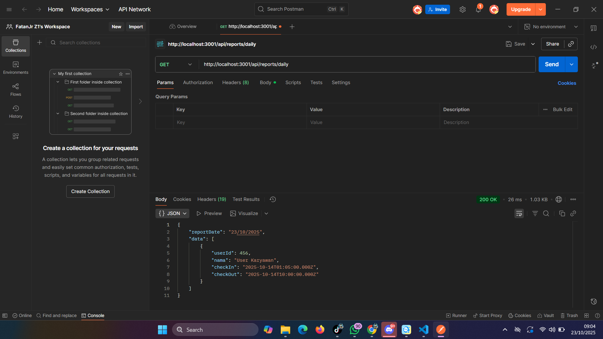

# Laporan Tugas Praktikum 3: API Presensi

Berikut adalah hasil pengujian endpoint API Presensi menggunakan Postman.

### 1. Presensi Check-in (Berhasil)
Ini adalah hasil ketika seorang karyawan berhasil melakukan check-in untuk pertama kali. Server merespon dengan status 201 Created.

---

### 2. Presensi Check-in (Gagal karena Duplikat)
Ini adalah hasil ketika karyawan yang sama mencoba melakukan check-in lagi sebelum check-out. Server menolak dengan pesan error yang sesuai.

---

### 3. Presensi Check-out (Berhasil)
Ini adalah hasil ketika karyawan yang sudah check-in berhasil melakukan check-out. Server merespon dengan status 200 OK.

---

### 4. Presensi Check-out (Gagal karena Belum Check-in)
Ini adalah hasil ketika seorang karyawan mencoba check-out padahal belum ada catatan check-in yang aktif. Server memberikan pesan error 404 Not Found.

---

### 5. Laporan Harian (Gagal sebagai Karyawan)
Ini adalah hasil ketika pengguna dengan role 'karyawan' mencoba mengakses laporan harian. Sesuai desain, middleware isAdmin memblokir akses dan mengembalikan status 403 Forbidden.

---

### 6. Laporan Harian (Berhasil sebagai Admin)
Setelah role diubah menjadi 'admin' di dalam middleware, pengguna berhasil mengakses laporan harian dan server merespon dengan data presensi dan status 200 OK.

