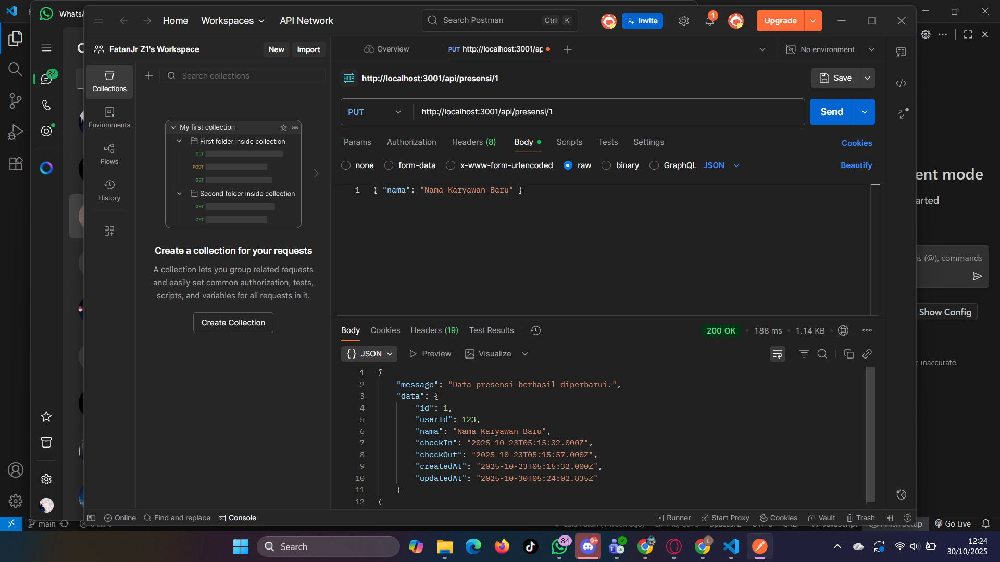
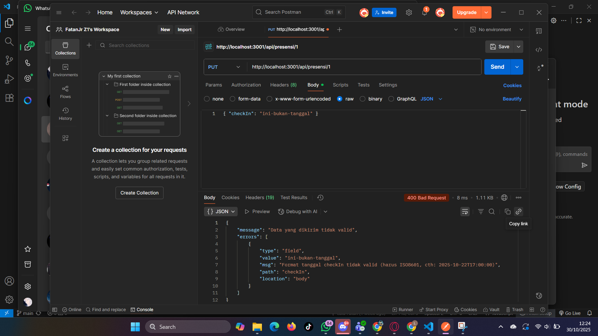
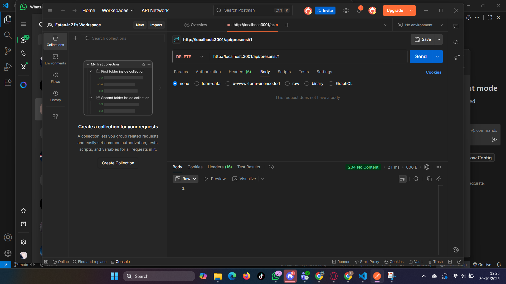
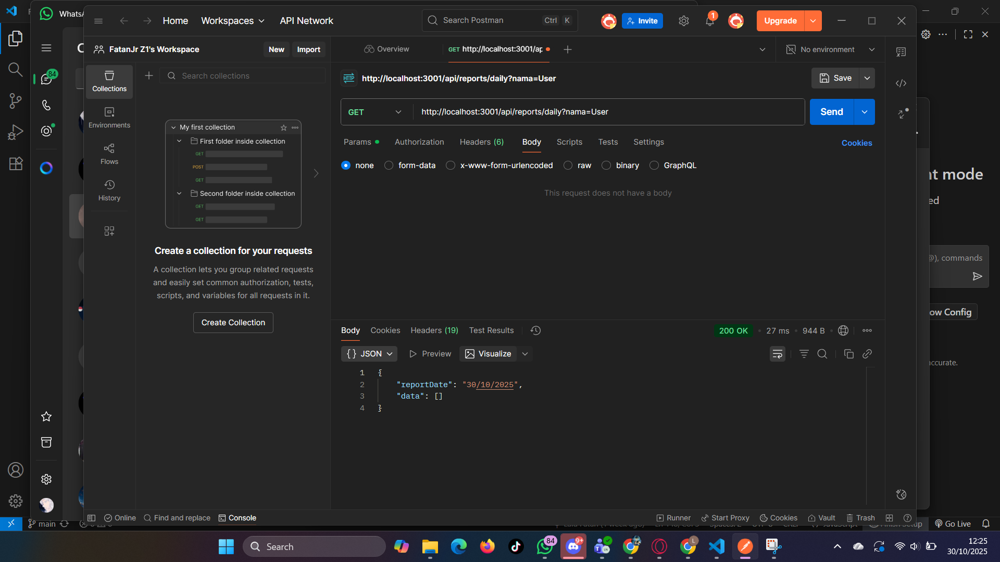
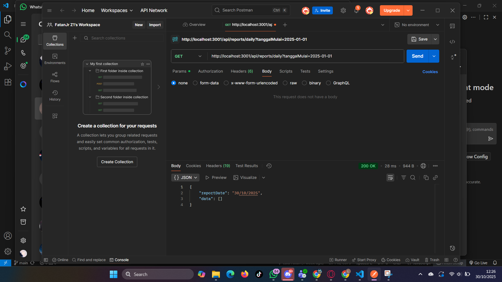

### 1. Endpoint Update Data Presensi (Berhasil)
Pengujian PUT /api/presensi/:id dengan mengirimkan data nama yang baru. Server merespon dengan 200 OK dan data yang telah diperbarui.

---

### 2. Endpoint Update (Gagal Validasi Format Tanggal)
Pengujian PUT /api/presensi/:id dengan mengirimkan data checkIn yang formatnya tidak valid. express-validator berhasil menangkap error dan mengembalikan 400 Bad Request.

---

### 3. Endpoint Delete Data Presensi
Pengujian DELETE /api/presensi/:id untuk menghapus data. Server merespon dengan 204 No Content yang menandakan data berhasil dihapus.

---

### 4. Endpoint Search Laporan (Berdasarkan Nama)
Pengujian GET /api/reports/daily?nama=... (sebagai admin). Server berhasil memfilter dan mengembalikan data yang namanya sesuai.

---

### 5. Endpoint Search Laporan (Berdasarkan Tanggal)
Pengujian GET /api/reports/daily?tanggalMulai=... (sebagai admin). Server berhasil memfilter dan mengembalikan data presensi yang sesuai dengan rentang tanggal.

